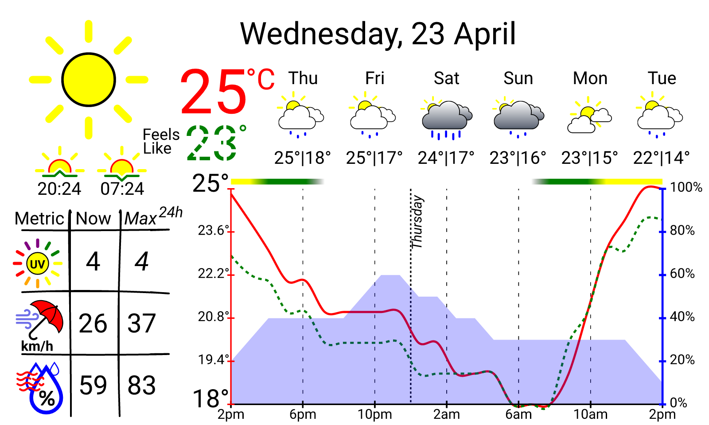
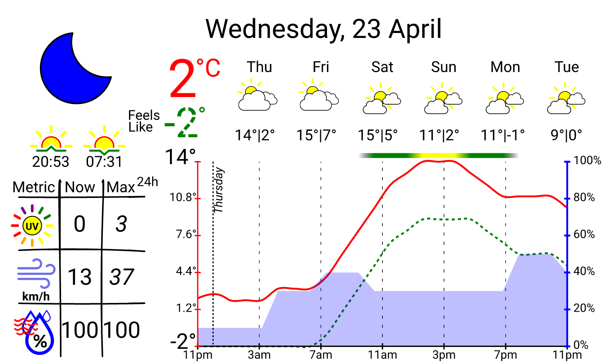
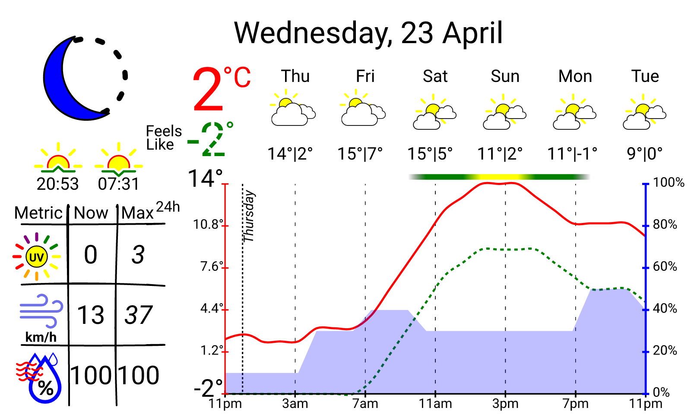
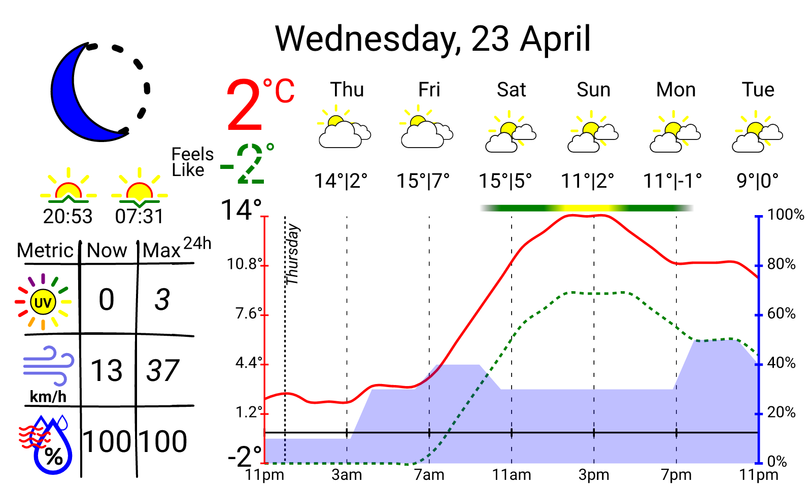
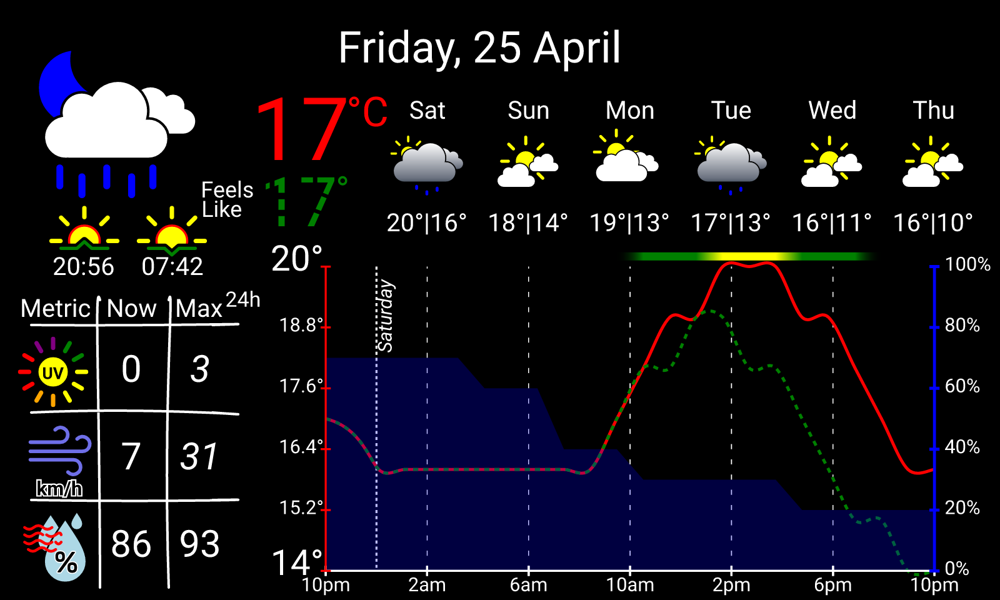

# Pi Inky Weather Display

This is a weather display powered by a Raspberry Pi and a 7.3in 7 colour E-Paper (aka E-ink) display. Weather data is obtained from the Australian Bureau of Meteorology API.



## Hardware
- Raspberry Pi (zero model requires soldering the GPIO Header)
- [Inky impression 7.3in E-Paper display](https://shop.pimoroni.com/products/inky-impression-7-3?variant=55186435244411)
- [3D printed case](https://github.com/mt-empty/inky-impression-7-3-colour-case) (optional)

## Setup on Raspberry Pi 

1. Install the Inky library:
   ```bash
   curl https://get.pimoroni.com/inky | bash
   ```
   For detailed installation steps, refer to the official [documentation](https://github.com/pimoroni/inky?tab=readme-ov-file#install-stable-library-from-pypi-and-configure-manually).

2. Download the latest release for your architecture from the [releases page](https://github.com/mt-empty/pi-inky-weather-epd/releases) and extract it:
   ```bash
   unzip <YOUR_DOWNLOAD_RELEASE>.tar.gz
   chmod +x pi-inky-weather-epd
   ```
3. Obtain a six-character geohash for your location from https://geohash.softeng.co

4. Create a configuration file with your geohash:
   ```bash
   echo -e '[api]\nlocation = "YOUR_GEOHASH"' > ~/.config/pi-inky-weather-epd.toml
   ```

   See [./config/development.toml](./config/default.toml) for example cities and their geohashes.

5. Set up an hourly cron job to update the display:
   ```bash
   (crontab -l 2>/dev/null; echo "0 * * * * cd /path/to/extracted/files && ./pi-inky-weather-epd && sudo PYTHON_PATH IMAGE_SCRIPT_PATH --file dashboard.png --saturation SATURATION") | crontab -
   ```
   Replace:
   - `/path/to/extracted/files` with your installation directory
   - `PYTHON_PATH` with path to Python (e.g., `/usr/bin/python3`)
   - `IMAGE_SCRIPT_PATH` with path to Inky's image.py (e.g., `/home/pi/Pimoroni/inky/examples/7color/image.py`)
   - `SATURATION` with the desired saturation level (e.g., `1.0`), it is not recommended to change this for current icons

   Example of complete cron command:
   ```bash
   0 * * * * cd /home/pi/pi-inky-weather-epd && ./pi-inky-weather-epd && sudo /home/dietpi/env/bin/python3 /home/dietpi/Pimoroni/inky/examples/7color/image.py --file dashboard.png --saturation 1.0
   ```

## Configuration

You can override the default configs located at [./config/](./config/) by creating a file at:
```bash
~/.config/pi-inky-weather-epd.toml
```

### Example configuration
Here are example configurations:

<table>
  <thead>
    <tr>
      <th>Example</th>
      <th>Preview</th>
      <th>Configuration Snippet</th>
    </tr>
  </thead>
  <tbody>
    <tr>
      <td><strong>Default configuration file</strong></td>
      <td>
        
      </td>
      <td>
        <pre><code class="language-toml">[render_options]
# When the sky is clear, the moon phase icon will be used instead of the clear night icon
use_moon_phase_instead_of_clear_night = false
</code></pre>
      </td>
    </tr>
    <tr>
      <td><strong>Enable Moon Phase when sky clear at night</strong></td>
      <td>
        <br/>
      </td>
      <td>
        <pre><code class="language-toml">[render_options]
# When the sky is clear, the moon phase icon will be used instead of the clear night icon
use_moon_phase_instead_of_clear_night = false
</code></pre>
      </td>
    </tr>
    <tr>
      <td><strong>Placement of x-axis at minimum</strong></td>
      <td>
        
      </td>
      <td>
        <pre><code class="language-toml">[render_options]
# this controls the placement of the x-axis when the temperature is below zero
x_axis_always_at_min = false
</code></pre>
      </td>
    </tr>
    <tr>
      <td><strong>Dark theme</strong></td>
      <td>
        
      </td>
      <td>
        <pre><code class="language-toml">[colours]
background_colour   = "black"
text_colour         = "white"

x_axis_colour       = "white"
y_left_axis_colour  = "red"
y_right_axis_colour = "blue"

actual_temp_colour  = "red"
feels_like_colour   = "green"
rain_colour         = "blue"
</code></pre>
      </td>
    </tr>
    <tr>
      <td><strong>Auto-update interval</strong></td>
      <td>N/A</td>
      <td>
        <pre><code class="language-toml">[release]
# set to 0 to disable auto-updating
update_interval_days = 7
</code></pre>
      </td>
    </tr>
  </tbody>
</table>


## Degraded operation

The dashboard can still work using cached data for a while if the API is unreachable.
You will see an icon and a small warning message appearing on the display in case of any errors.
| Error Type          | Icon                                                                                                |
| ------------------- | --------------------------------------------------------------------------------------------------- |
| **Api Error**       |           |
| **No Internet**     |      |
| **Incomplete Data** |  |


## Inky Impression 7.3

### Supported colours at 1.0 Saturation

```
[0, 0, 0],        # Black
[255, 255, 255],  # White
[0, 255, 0],      # Green
[0, 0, 255],      # Blue
[255, 0, 0],      # Red
[255, 255, 0],    # Yellow
[255, 140, 0],    # Orange
```

#### Trial and error found colours

These colours were found by trial and error:
```
[255, 248, 220, 255], // Cornsilk
[255, 250, 205, 255], // Lemon Chiffon
[255, 20, 147, 255],  // DeepPink
```

## Documentation and Resources

- EPD used: Inky Impression 7.3 https://shop.pimoroni.com/products/inky-impression-7-3?variant=40512683376723
- Actual Panel: Waveshare display https://www.waveshare.com/7.3inch-e-paper-hat-f.htm
- Panel documentation: https://www.waveshare.com/wiki/7.3inch_e-Paper_HAT_(F)_Manual#Overview
- BOM API: https://github.com/bremor/bureau_of_meteorology/blob/main/api%20doc/API.md
- [Icons](./static/fill-svg-static/) have been overhauled, which were originality based on: https://bas.dev/work/meteocons

## TODO
- [ ] Testing: create a script that auto generates some/all weather variations
  - This script should simulate different weather conditions (e.g., sunny, rainy, cloudy) and generate corresponding images for testing the display.

### Wish List
- [ ] An algorithm that is smooth and does not overshoot
- [ ] Rain gradient that looks like rain
- [ ] Overhaul the [line svg icons](./static/fill-svg-static/) to match display colours
- [ ] Inline all svg icons into the template and have full control over the colours

## Developing

Any Contributions are welcome!

### Setup

Your local config should go into `config/local.toml`:
```bash
cp config/development.toml config/local.toml
cargo run
```

### Compile for target release

Example for Raspberry Pi Zero:

```bash
cross build --release --target arm-unknown-linux-gnueabihf 
```

### Using mDNS for Easy Access

This is optional, but you can use **mDns** to access your pi by hostname instead of IP address.

To do this, you need to install **avahi-daemon** on your pi. This is a service that allows you to discover devices on the network using their hostname.

```bash
sudo apt-get install avahi-daemon
sudo systemctl enable avahi-daemon
sudo systemctl start avahi-daemon
```

The pi should now be discoverable by `<hostname>.local`

```
Host pizero
  Hostname <hostname>.local
  User <your username on the raspberry pi>
  IdentityFile <path to your private key>
  ServerAliveInterval 60
  ServerAliveCountMax 240
```

ssh into it by running `ssh pizero`

### Sending image to pi over ssh 

Once you have your ssh setup:

```bash
chmod +x ./misc/send-img-to-pi.sh
cargo run
./misc/send-img-to-pi.sh
```

## Troubleshooting

- Execute the ./pi-inky-weather-epd separately and observe the logs for any errors, then open the generated image to see if it is correct.
- Run the cron script manually to see if there are any errors

#### Issues with latest version of Inky 

If you encounter issues with the latest version of Inky, try manually installing version **1.5.0** release of the inky library, refer to the official [documentation](https://github.com/pimoroni/inky?tab=readme-ov-file#install-stable-library-from-pypi-and-configure-manually)

### Special Instructions for DietPi

For **DietPi** distro working with version **1.5**, you may need to set `include-system-site-packages = true` in your Python virtual environment.  
To do this, after creating your virtual environment (e.g., with `python3 -m venv /path/to/env`), open the file:

```
/path/to/env/pyvenv.cfg
```

and add or set the following line:

```
include-system-site-packages = true
```

This allows the virtual environment to access system-wide Python packages, which may be required for the installation script to work.

You may also need to modify the inky installation script so that `pip3` points to the the created environment's `pip3` instead of the system `pip3`.