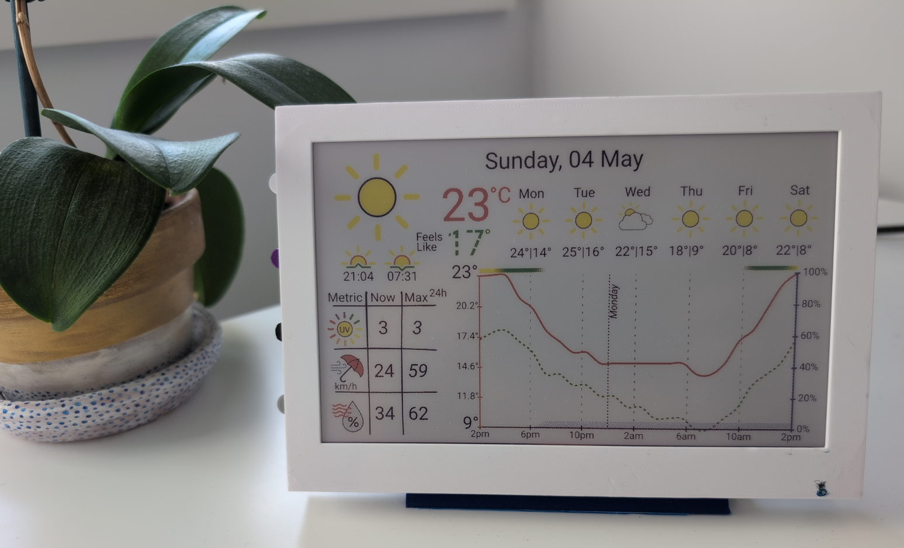
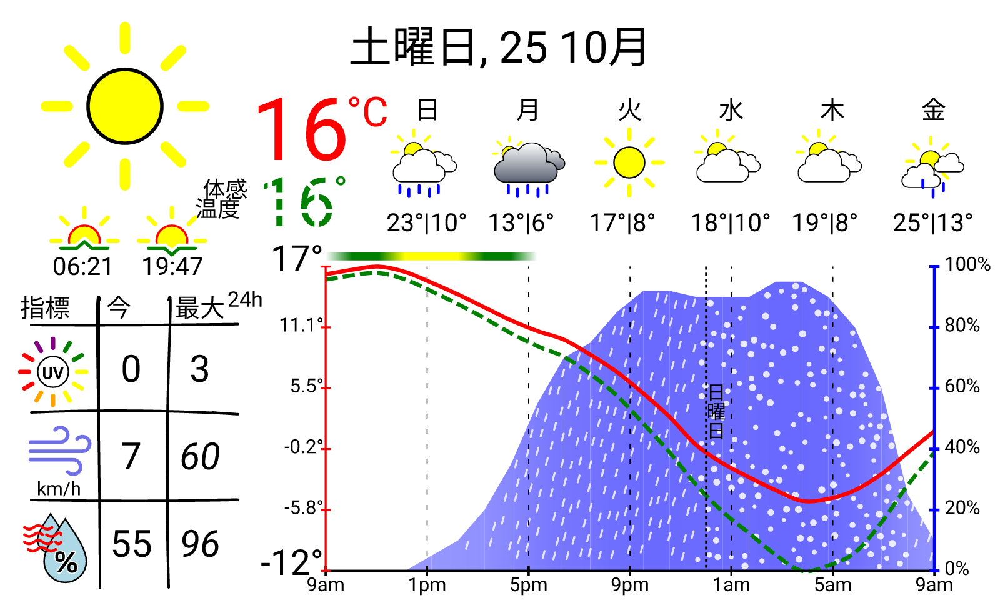
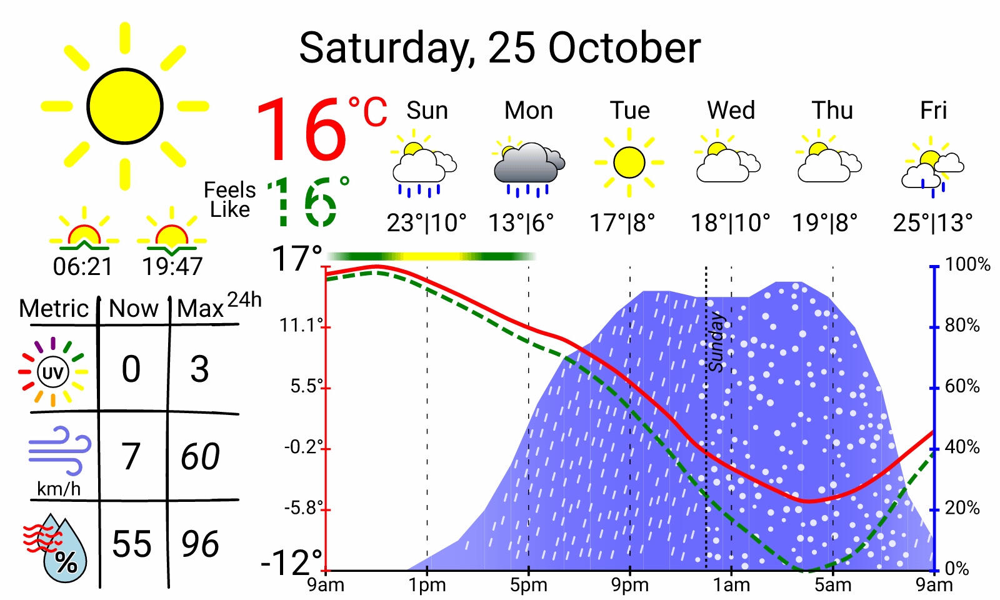
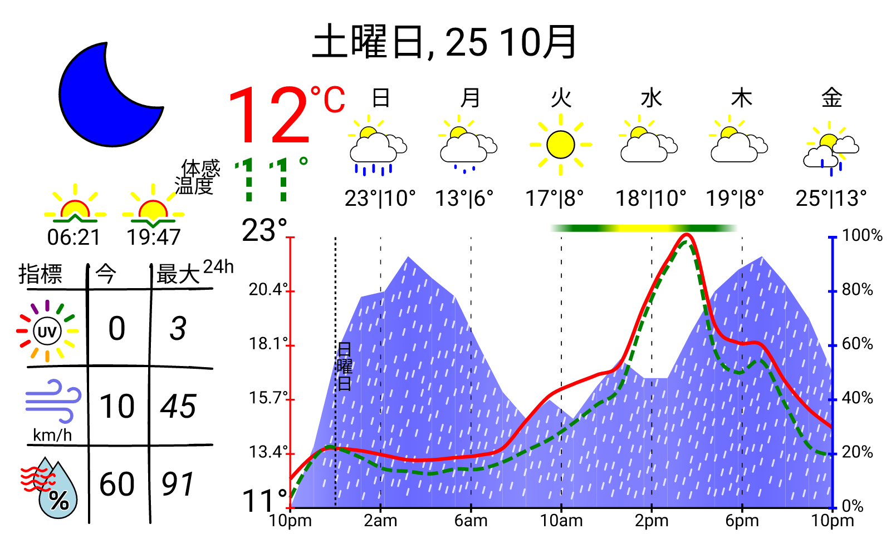
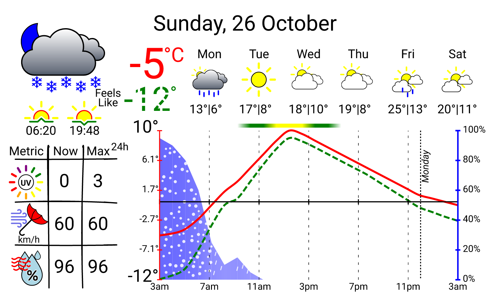
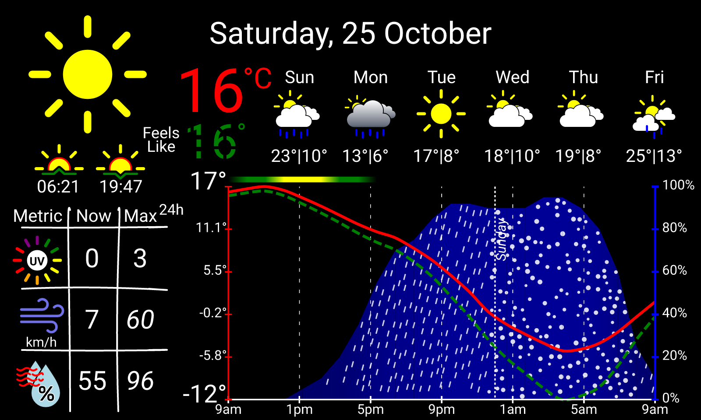

<div align="center">

# Pi Inky Weather Display

[](https://github.com/mt-empty/pi-inky-weather-epd/actions/workflows/test.yml)


*A beautiful weather dashboard for Raspberry Pi with 7.3" e-paper display*

[Features](#features) • [Quick Start](#quick-start) • [Hardware](#hardware) • [Configuration](#configuration) • [Development](#development)


</div>

The generation of the image is independent of the hardware, so it can be used on any hardware stack.


## Hardware

- Raspberry Pi (Zero model requires soldering the GPIO header)
- [Inky Impression 7.3" E-Paper display](https://shop.pimoroni.com/products/inky-impression-7-3?variant=55186435244411)
- [3D printed case](https://github.com/mt-empty/inky-impression-7-3-colour-case) (optional)



## Quick Setup on Raspberry Pi

1. **Install the Inky library:**

   ```bash
   curl https://get.pimoroni.com/inky | bash
   ```

   For detailed installation steps, refer to the official [documentation](https://github.com/pimoroni/inky?tab=readme-ov-file#install-stable-library-from-pypi-and-configure-manually).

2. **Download the latest release:**

   Download the latest release for your architecture from the [releases page](https://github.com/mt-empty/pi-inky-weather-epd/releases) and extract it:

   <details>
    <summary><b>Architecture Guide</b></summary>

    | Raspberry Pi Model | Architecture | Download |
    |-------------------|--------------|----------|
    | Pi 1, Zero, Zero W | `arm-unknown-linux-gnueabihf` | ARMv6 |
    | Pi 2, 3, 4, Zero 2 W (32-bit OS) | `armv7-unknown-linux-gnueabihf` | ARMv7 |
    | Pi 3, 4, 5 (64-bit OS) | `aarch64-unknown-linux-gnu` | ARMv8 |
    | x86 Linux | `x86_64-unknown-linux-gnu` | x64 |

   </details>

   ```bash
    # Download and extract
    wget https://github.com/mt-empty/pi-inky-weather-epd/releases/latest/download/pi-inky-weather-epd-<architecture>.zip
    unzip pi-inky-weather-epd-<architecture>.zip
    chmod +x pi-inky-weather-epd
   ```

3. **Configure your weather data provider and location:**

   Get your latitude and longitude from <https://www.latlong.net/> and create a configuration file:

   ```bash
   mkdir -p ~/.config
   cat > ~/.config/pi-inky-weather-epd.toml << EOF
   [api]
   latitude = YOUR_LATITUDE   # e.g., -33.8727 # Sydney
   longitude = YOUR_LONGITUDE # e.g., 151.2057
   provider = "open_meteo"    # "open_meteo" (worldwide) or "bom" (Australia only)
   EOF
   ```

   See [./config/default.toml](./config/default.toml) for more configuration examples.

4. **Set up an hourly cron job to update the display:**

   ```bash
   (crontab -l 2>/dev/null; echo "0 * * * * cd /path/to/extracted/files && ./pi-inky-weather-epd && sudo <PYTHON_PATH> <IMAGE_SCRIPT_PATH> --file dashboard.png --saturation <SATURATION>") | crontab -
   ```

   Replace:
   - `/path/to/extracted/files` with your installation directory
   - `<PYTHON_PATH>` with path to Python (e.g., `/usr/bin/python3`)
   - `<IMAGE_SCRIPT_PATH>` with path to Inky's `image.py` (e.g., `/home/pi/Pimoroni/inky/examples/7color/image.py`)
   - `<SATURATION>` with the desired saturation level depending on your display (e.g., `1.0`). If using the Inky Impression 7 colours, it is not recommended to change this for current icons

   **Example of complete cron command:**

   ```bash
   0 * * * * cd /home/pi/pi-inky-weather-epd && ./pi-inky-weather-epd && sudo /home/dietpi/env/bin/python3 /home/dietpi/Pimoroni/inky/examples/7color/image.py --file dashboard.png --saturation 1.0
   ```

## Configuration

You can override the default configs located at [./config/](./config/) by creating a file at:

```bash
~/.config/pi-inky-weather-epd.toml
```


<!-- #### Default Configuration

 -->

#### Language (UI Localisation)

The dashboard supports multiple interface languages for compact UI labels and day names.



Example renders for each supported language:
[en](./misc/languages/dashboard-en.png) ·
[fr](./misc/languages/dashboard-fr.png) ·
[de](./misc/languages/dashboard-de.png) ·
[es](./misc/languages/dashboard-es.png) ·
[ja](./misc/languages/dashboard-ja.png)


#### Use Clear night Icon instead of Moon Phase icon when Time=night and Weather=clear



When the sky is clear, the moon phase icon is used instead of the clear night icon, you can disable with:

```toml
[render_options]
use_moon_phase_instead_of_clear_night = false
```

#### Set X-Axis Placement to be always at y=0



The x-axis is no longer at the bottom of the graph when the temperature is below zero, it is now always positioned at x = 0.

```toml
[render_options]
x_axis_always_at_min = false
```

#### Dark Theme



```toml
[colours]
background_colour   = "black"
text_colour         = "white"

x_axis_colour       = "white"
y_left_axis_colour  = "red"
y_right_axis_colour = "blue"

actual_temp_colour  = "red"
feels_like_colour   = "green"
rain_colour         = "blue"
```

#### Auto-Update Interval

Enable auto-update when a new release is available. This is enabled by default.

```toml
[release]
# Set to 0 to disable auto-updating
update_interval_days = 7
# Opt in to pre-release versions (requires update_interval_days > 0)
allow_pre_release_version = false
```

### Full Configuration Reference

The examples above cover the most commonly changed settings. Every available
key, its type, and its default value:

| Section | Key | Type | Default | Description |
| --- | --- | --- | --- | --- |
| `[api]` | `latitude` | float | `-37.8136` | Location latitude |
| `[api]` | `longitude` | float | `144.9631` | Location longitude |
| `[api]` | `provider` | string | `"open_meteo"` | `"open_meteo"` (worldwide) or `"bom"` (Australia only) |
| `[colours]` | `background_colour` | string | `"white"` | Dashboard background colour |
| `[colours]` | `text_colour` | string | `"black"` | Text colour |
| `[colours]` | `x_axis_colour` | string | `"black"` | X-axis line colour |
| `[colours]` | `y_left_axis_colour` | string | `"red"` | Temperature axis colour |
| `[colours]` | `y_right_axis_colour` | string | `"blue"` | Rain scale axis colour |
| `[colours]` | `actual_temp_colour` | string | `"red"` | Actual temperature line colour |
| `[colours]` | `feels_like_colour` | string | `"green"` | Feels-like temperature line colour |
| `[colours]` | `rain_colour` | string | `"blue"` | Rain forecast fill colour (raindrops always white) |
| `[colours]` | `snow_colour` | string | `"blue"` | Snow forecast fill colour (snowflakes always white) |
| `[render_options]` | `temp_unit` | string | `"C"` | `"C"` or `"F"` |
| `[render_options]` | `wind_speed_unit` | string | `"km/h"` | `"km/h"`, `"mph"`, or `"knots"` |
| `[render_options]` | `language` | string | `"en"` | UI language: `en`, `fr`, `de`, `es`, `ja` |
| `[render_options]` | `date_format` | string | `"%A, %d %B"` | [chrono strftime](https://docs.rs/chrono/latest/chrono/format/strftime/) format |
| `[render_options]` | `use_moon_phase_instead_of_clear_night` | bool | `true` | Show moon phase icon instead of clear-night icon |
| `[render_options]` | `x_axis_always_at_min` | bool | `true` | Keep x-axis at y=0 when temperature is below zero |
| `[render_options]` | `use_gust_instead_of_wind` | bool | `false` | Display gust speed instead of sustained wind speed |
| `[render_options]` | `prefer_weather_codes` | bool | `true` | Prefer WMO weather codes for icon selection (no effect with `bom` provider) |
| `[render_options]` | `precipitation_opacity_min` | float | `0.40` | Gradient fill opacity at 0% precipitation chance (0.0–1.0, must be < max) |
| `[render_options]` | `precipitation_opacity_max` | float | `0.60` | Gradient fill opacity at 100% precipitation chance (0.0–1.0, must be > min) |
| `[misc]` | `timezone` | string | unset (system timezone) | IANA timezone override for displayed times |
| `[release]` | `update_interval_days` | int | `7` | Days between auto-update checks; `0` disables |
| `[release]` | `allow_pre_release_version` | bool | `false` | Opt in to pre-release versions |

See [./config/default.toml](./config/default.toml) for the authoritative source.

## Degraded Operation

The dashboard can still work using cached data for a while if the API is unreachable. A diagnostic icon and message appears on the display when issues occur.

| Diagnostic Type     | Priority | Icon                                                                                                |
| ------------------- | -------- | --------------------------------------------------------------------------------------------------- |
| **API Error**       | High     |           |
| **No Internet**     | Medium   |      |
| **Incomplete Data** | Low      |  |
| **Update Failed**   | Low      |     |

When multiple diagnostics occur, the highest priority diagnostic is displayed, lower priority ones are cascaded.

## Inky Impression 7.3

### Supported Colours at 1.0 Saturation (Without Dithering)

```rust
[0, 0, 0],        # Black
[255, 255, 255],  # White
[0, 255, 0],      # Green
[0, 0, 255],      # Blue
[255, 0, 0],      # Red
[255, 255, 0],    # Yellow
[255, 140, 0],    # Orange
```

## Documentation and Resources

- **EPD used:** [Inky Impression 7.3](https://shop.pimoroni.com/products/inky-impression-7-3?variant=40512683376723)
- **Actual Panel:** [Waveshare 7.3" E-Paper HAT](https://www.waveshare.com/7.3inch-e-paper-hat-f.htm)
- **Panel documentation:** [Waveshare Wiki](https://www.waveshare.com/wiki/7.3inch_e-Paper_HAT_(F)_Manual#Overview)
- **Open-Meteo API:** [Open-Meteo Weather Forecast API](https://open-meteo.com/en/docs) (default provider)
- **BOM API:** [Bureau of Meteorology API Documentation](https://github.com/bremor/bureau_of_meteorology/blob/main/api%20doc/API.md) (Australia only)
- **Icons:** [Custom SVG icons](./static/fill-svg-static/) complete overhauled of [Meteocons](https://bas.dev/work/meteocons)

## Design Decisions

**Image generation is hardware-agnostic.** Weather data is rendered to an SVG via TinyTemplate, then converted to PNG with resvg.

**Degrades instead of failing.** If the API is unreachable, the fetcher falls back to the last cached response and keeps rendering, surfacing a priority-ordered [diagnostic icon](#degraded-operation)

**Config for personalisation.** Colours, units, date format, and axis behaviour are all TOML overrides layered on `config/default.toml` — no fork needed to reskin the dashboard.

**Backward-compatible by default.** The binary can self-update in place on unattended Pi devices

**Deterministic testing by injecting Time** Time-dependent logic goes through a `Clock` abstraction rather than calling the system clock directly, so tests and the [24-hour simulation script](docs/CONTRIBUTING.md#dashboard-simulation) can drive arbitrary times deterministically.

## Contributing

Contributions are welcome — see [docs/CONTRIBUTING.md](docs/CONTRIBUTING.md)
for dev setup, running tests, simulating dashboards, and troubleshooting.
