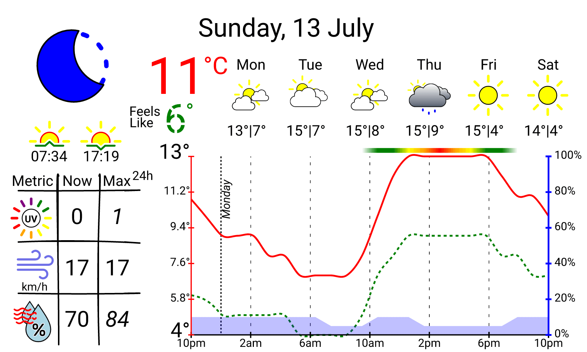

<div align="center">

# Pi Inky Weather Display

[](https://github.com/mt-empty/pi-inky-weather-epd/actions/workflows/test.yml)


*A beautiful weather dashboard for Raspberry Pi with 7.3" e-paper display*

[Features](#features) • [Quick Start](#quick-start) • [Hardware](#hardware) • [Configuration](#configuration) • [Development](#development)



</div>

## Overview

Transform your Raspberry Pi into an elegant weather station with this Rust-powered dashboard designed for the Inky Impression 7.3" 7-color e-paper display. The application fetches weather data from multiple providers, renders beautiful SVG graphics, and displays comprehensive forecasts with hourly and daily insights.

**Key highlights:**
- **Multiple weather providers** - Open-Meteo (worldwide) and BOM (Australia)
- **Rich visualizations** - Temperature curves, precipitation graphs, and weather icons
- **Robust operation** - Falls back to cached data when offline
- **Auto-updates** - Automatically downloads and installs new releases
- **Highly customizable** - Extensive configuration options for appearance and behavior

## Features

- **Dual Weather Providers**: Choose between Open-Meteo (global coverage) or Australian Bureau of Meteorology
- **Comprehensive Forecasts**: Hourly predictions and 7-day outlook with temperature trends and precipitation data
- **Smart Caching**: Continues working with cached data during network outages
- **Auto-Updates**: Automatically checks and installs new releases from GitHub
- **Customizable Display**: Configure units (metric/imperial), colors, date formats, and graph styles
- **Moon Phases**: Optional moon phase display for clear night conditions
- **Diagnostic Icons**: Visual indicators for API errors, network issues, or stale data
- **Zero Dependencies**: Single binary with no runtime requirements except the Inky Python library for display output

## Hardware

### Required Components

- **Raspberry Pi** - Any model with GPIO header (Zero, 3, 4, or 5)
  - Zero models require soldering the GPIO header
- **[Inky Impression 7.3" E-Paper Display](https://shop.pimoroni.com/products/inky-impression-7-3?variant=55186435244411)** - 7-color e-paper HAT
  - Display resolution: 800×480 pixels
  - Supported colors: Black, white, red, yellow, orange, green, blue

### Optional

- **[3D Printed Case](https://github.com/mt-empty/inky-impression-7-3-colour-case)** - Custom enclosure for wall mounting

<details>
<summary><b>Example Setup</b></summary>


</details>

## Quick Start

### Prerequisites

- Raspberry Pi with Raspbian/Raspberry Pi OS
- [Inky Impression 7.3" display](https://shop.pimoroni.com/products/inky-impression-7-3) connected via GPIO
- Internet connection for weather data

### Installation

**1. Install the Inky Python library**

```bash
curl https://get.pimoroni.com/inky | bash
```

> See the [official documentation](https://github.com/pimoroni/inky?tab=readme-ov-file#install-stable-library-from-pypi-and-configure-manually) for manual installation steps.

**2. Download the latest release**

Download the appropriate binary for your Raspberry Pi model from the [releases page](https://github.com/mt-empty/pi-inky-weather-epd/releases):

<details>
<summary><b>Architecture Guide</b></summary>

| Raspberry Pi Model | Architecture | Download |
|-------------------|--------------|----------|
| Pi 1, Zero, Zero W | `arm-unknown-linux-gnueabihf` | ARMv6 |
| Pi 2, 3, 4, Zero 2 W (32-bit OS) | `armv7-unknown-linux-gnueabihf` | ARMv7 |
| Pi 3, 4, 5 (64-bit OS) | `aarch64-unknown-linux-gnu` | ARMv8 |
| x86 Linux | `x86_64-unknown-linux-gnu` | x64 |

</details>

```bash
# Download and extract
wget https://github.com/mt-empty/pi-inky-weather-epd/releases/latest/download/pi-inky-weather-epd-<architecture>.zip
unzip pi-inky-weather-epd-<architecture>.zip
chmod +x pi-inky-weather-epd
```

**3. Configure your location**

Create a configuration file with your coordinates:

```bash
mkdir -p ~/.config
cat > ~/.config/pi-inky-weather-epd.toml << 'EOF'
[api]
latitude = -33.8727    # Your latitude (e.g., Sydney)
longitude = 151.2057   # Your longitude
provider = "open_meteo" # "open_meteo" (worldwide) or "bom" (Australia only)
EOF
```

> Get your coordinates from [latlong.net](https://www.latlong.net/)

**4. Test the installation**

```bash
./pi-inky-weather-epd
```

This will generate `dashboard.png` in the current directory. Verify the image looks correct before proceeding.

**5. Set up automatic updates**

Add a cron job to refresh the display every hour:

```bash
crontab -e
```

Add this line (adjust paths for your setup):

```cron
0 * * * * cd /home/pi/pi-inky-weather-epd && ./pi-inky-weather-epd && sudo /usr/bin/python3 /home/pi/Pimoroni/inky/examples/7color/image.py --file dashboard.png --saturation 1.0
```

**Cron command breakdown:**
- `0 * * * *` - Run every hour at minute 0
- `cd /home/pi/pi-inky-weather-epd` - Navigate to installation directory
- `./pi-inky-weather-epd` - Generate the weather dashboard image
- `sudo /usr/bin/python3 ...` - Display the image on the e-paper screen
- `--saturation 1.0` - Color saturation (recommended: 1.0 for Inky Impression 7)

## Configuration

Customize the dashboard by creating `~/.config/pi-inky-weather-epd.toml`. All settings in [config/default.toml](./config/default.toml) can be overridden.

### Common Configuration Examples

<details open>
<summary><b>Weather Provider Selection</b></summary>

Choose between Open-Meteo (worldwide) or Bureau of Meteorology (Australia only):

```toml
[api]
latitude = -37.8136
longitude = 144.9631
provider = "open_meteo"  # or "bom"
```

</details>

<details>
<summary><b>Imperial Units</b></summary>

Switch to Fahrenheit and miles per hour:

```toml
[render_options]
temp_unit = "F"
wind_speed_unit = "mph"
```


</details>

<details>
<summary><b>Custom Date Format</b></summary>

Change date display using [chrono strftime](https://docs.rs/chrono/latest/chrono/format/strftime/) format specifiers:

```toml
[render_options]
date_format = "%B %-d, %Y"  # December 6, 2025 (US style)
# date_format = "%d/%m/%Y"  # 06/12/2025 (Australia/UK)
# date_format = "%Y-%m-%d"  # 2025-12-06 (ISO 8601)
# date_format = "%a, %-d %b" # Sat, 6 Dec
```

</details>

<details>
<summary><b>Moon Phase Display</b></summary>

Toggle moon phase icons for clear nights:

```toml
[render_options]
use_moon_phase_instead_of_clear_night = false
```


</details>

<details>
<summary><b>Graph X-Axis Position</b></summary>

Position the x-axis at zero instead of the minimum value:

```toml
[render_options]
x_axis_always_at_min = false
```


</details>

<details>
<summary><b>Dark Theme</b></summary>

Invert colors for a dark mode appearance:

```toml
[colours]
background_colour = "black"
text_colour = "white"
x_axis_colour = "white"
y_left_axis_colour = "red"
y_right_axis_colour = "blue"
actual_temp_colour = "red"
feels_like_colour = "green"
rain_colour = "blue"
```


</details>

<details>
<summary><b>Auto-Update Settings</b></summary>

Configure automatic updates from GitHub releases:

```toml
[release]
update_interval_days = 7  # Set to 0 to disable auto-updating
```

</details>

### Advanced Configuration

For a complete list of all available configuration options, see [config/default.toml](./config/default.toml).

## Resilience & Error Handling

The application is designed to work reliably even when network conditions are poor. When the weather API is unreachable, the dashboard automatically falls back to cached data and displays diagnostic indicators.

### Diagnostic Icons

Visual feedback helps you understand the system's operational status:

| Status | Priority | Icon | Description |
|--------|----------|------|-------------|
| **API Error** | High |  | Weather service returned an error |
| **No Internet** | Medium |  | Network connectivity issues |
| **Incomplete Data** | Low |  | Partial data received |
| **Update Failed** | Low |  | Self-update unsuccessful |

> **Note:** When multiple issues occur simultaneously, the highest priority diagnostic is displayed prominently, with lower priority indicators cascading behind it.

## Development

### Local Development Setup

**Prerequisites:**
- Rust 1.83+ (see [rust-toolchain.toml](./rust-toolchain.toml))
- Git
- Cross (for ARM compilation): `cargo install cross`

**Clone and build:**

```bash
git clone https://github.com/mt-empty/pi-inky-weather-epd.git
cd pi-inky-weather-epd

# Create local configuration
cp config/development.toml config/local.toml
# Edit config/local.toml with your coordinates

# Build and run
cargo run
```

### Development Tools

**Install Git hooks** (enforces formatting, linting, and tests):

```bash
./scripts/setup-git-hooks.sh
```

**Available VSCode tasks** (Ctrl/Cmd+Shift+B):
- `cargo-build` - Build debug binary
- `cargo-run` - Run locally
- `cargo-test(open_meteo)` - Run all tests
- `cargo-clippy` - Lint code

### Testing

```bash
# Run all tests
RUN_MODE=test cargo test

# Run BOM provider tests
RUN_MODE=test APP_API__PROVIDER=bom cargo test --test snapshot_provider_test

# Review snapshot changes (uses insta crate)
cargo insta review
```

### Dashboard Simulation

Generate 24 hours of dashboard images for testing time-dependent features or creating animations:

```bash
# Build with CLI support (not included in production builds)
cargo build --features cli

# Generate 24 hourly dashboards
./scripts/simulate-24h.sh [date] [start_hour] [timezone]

# Examples:
./scripts/simulate-24h.sh                                       # Default: today from midnight UTC
./scripts/simulate-24h.sh 2025-12-26 6                          # Start from 6am
./scripts/simulate-24h.sh 2025-12-26 0 "Australia/Melbourne"    # With specific timezone
```

**How it works:**
- Automatically fetches fresh weather data before simulation base on your current config
- Generates 24 hourly dashboards using consistent cached data
- Output saved to `simulation_output/` directory

Useful for testing sunrise/sunset transitions, hourly forecast charts, and creating time-lapse animations.

### Cross-Compilation for Raspberry Pi

```bash
# Pi Zero (ARMv6)
cross build --release --target arm-unknown-linux-gnueabihf

# Pi 3/4 32-bit (ARMv7)
cross build --release --target armv7-unknown-linux-gnueabihf

# Pi 4/5 64-bit (ARMv8)
cross build --release --target aarch64-unknown-linux-gnu
```

### Code Quality Standards

The CI pipeline enforces:
- ✅ `cargo fmt` - Consistent code formatting
- ✅ `cargo clippy -- -D warnings` - Zero clippy warnings
- ✅ `cargo test` - All tests passing
- ✅ Snapshot tests with [insta](https://insta.rs/)

## Technical Details

### Architecture

**Built with:**
- **Language:** Rust 2021 edition
- **Rendering:** SVG templates via [TinyTemplate](https://docs.rs/tinytemplate/) → PNG via [resvg](https://docs.rs/resvg/)
- **HTTP:** [reqwest](https://docs.rs/reqwest/) with blocking client
- **Configuration:** Hierarchical config merging with [config](https://docs.rs/config/) crate
- **Testing:** Snapshot testing with [insta](https://insta.rs/), deterministic time via `Clock` trait

**Data flow:**
```
Weather API → Provider → Domain Models → Context Builder → SVG Template → PNG → E-Paper Display
```

### Display Specifications

**Inky Impression 7.3" E-Paper:**
- Resolution: 800×480 pixels
- Colors: 7 (black, white, red, yellow, orange, green, blue)
- Technology: [Waveshare 7.3" ACeP panel](https://www.waveshare.com/7.3inch-e-paper-hat-f.htm)
- Refresh time: ~30 seconds

**Supported RGB values (at saturation 1.0):**
```rust
Black:   [0, 0, 0]
White:   [255, 255, 255]
Red:     [255, 0, 0]
Yellow:  [255, 255, 0]
Orange:  [255, 140, 0]
Green:   [0, 255, 0]
Blue:    [0, 0, 255]
```

## Resources

- **Weather APIs:**
  - [Open-Meteo Forecast API](https://open-meteo.com/en/docs) - Free worldwide weather data
  - [Bureau of Meteorology API](https://github.com/bremor/bureau_of_meteorology/blob/main/api%20doc/API.md) - Australian weather service
- **Hardware:**
  - [Inky Impression 7.3" Product Page](https://shop.pimoroni.com/products/inky-impression-7-3)
  - [Waveshare Panel Documentation](https://www.waveshare.com/wiki/7.3inch_e-Paper_HAT_(F)_Manual)
  - [3D Printable Case Design](https://github.com/mt-empty/inky-impression-7-3-colour-case)
- **Icons:** [Custom weather icons](./static/fill-svg-static/) (derived from [Meteocons](https://bas.dev/work/meteocons))

## Contributing

Contributions are welcome! Whether it's bug reports, feature requests, or code contributions, all help is appreciated.

### Before You Start

- Check existing [issues](https://github.com/mt-empty/pi-inky-weather-epd/issues) to avoid duplicates
- Comment on an issue if you plan to work on it
- For major changes, open an issue first to discuss your proposal

### Pull Request Guidelines

Before submitting a PR:

1. **Reference the related issue** in your PR description
2. **Add tests** for new functionality or bug fixes
3. **Run quality checks:**
   ```bash
   cargo fmt
   cargo clippy -- -D warnings
   RUN_MODE=test cargo test
   ```
4. **Review snapshot changes** if dashboard output changed:
   ```bash
   cargo insta review
   ```

### Development Tips

**mDNS for easier Pi access:**

```bash
# On Raspberry Pi
sudo apt-get install avahi-daemon
sudo systemctl enable avahi-daemon
sudo systemctl start avahi-daemon

# Add to ~/.ssh/config on your dev machine
Host pizero
  Hostname pizero.local
  User pi
  IdentityFile ~/.ssh/id_rsa
```

**Deploy images over SSH:**

```bash
# Generate dashboard locally
cargo run

# Send to Pi (requires SSH setup)
./scripts/send-img-to-pi.sh
```

## Troubleshooting

### General Debugging

**Test the binary directly:**

```bash
./pi-inky-weather-epd
# Check the logs for errors and verify dashboard.png is generated correctly
```

**Test the cron job manually:**

```bash
# Run the full command from your crontab
cd /home/pi/pi-inky-weather-epd && ./pi-inky-weather-epd && sudo python3 /path/to/image.py --file dashboard.png --saturation 1.0
```

### Common Issues

<details>
<summary><b>Inky library compatibility issues</b></summary>

If you experience problems with the latest Inky version, install version 1.5.0 specifically:

```bash
pip3 install inky==1.5.0
```

See the [official documentation](https://github.com/pimoroni/inky?tab=readme-ov-file#install-stable-library-from-pypi-and-configure-manually) for manual installation steps.

</details>

<details>
<summary><b>DietPi Python environment issues</b></summary>

For DietPi users running Inky 1.5 in a virtual environment, you may need to enable system site packages:

1. Edit your venv config:
   ```bash
   nano /path/to/env/pyvenv.cfg
   ```

2. Add or update this line:
   ```ini
   include-system-site-packages = true
   ```

3. Modify the Inky installation script to use your venv's `pip3` instead of the system one.

</details>

<details>
<summary><b>Weather data not updating</b></summary>

- Verify your internet connection
- Check if cached data exists in `~/.cache/pi-inky-weather-epd/` or your configured cache directory
- Run with debug logging: check application output for API errors
- Test your coordinates at [open-meteo.com](https://open-meteo.com/en/docs) or BOM website

</details>

<details>
<summary><b>Display shows diagnostic icons</b></summary>

See the [Resilience & Error Handling](#resilience--error-handling) section for what each diagnostic icon means. The application will continue using cached data when possible.

</details>

### Getting Help

If you're stuck:
1. Check [existing issues](https://github.com/mt-empty/pi-inky-weather-epd/issues)
2. [Open a new issue](https://github.com/mt-empty/pi-inky-weather-epd/issues/new) with:
   - Raspberry Pi model and OS version
   - Binary architecture used
   - Full error logs from running `./pi-inky-weather-epd`
   - Your configuration file (redact coordinates if needed)

---

<div align="center">

**[⬆ Back to Top](#pi-inky-weather-display)**

Built with ❤️ using Rust • Powered by [Open-Meteo](https://open-meteo.com) & [BOM](http://www.bom.gov.au/)

</div>
